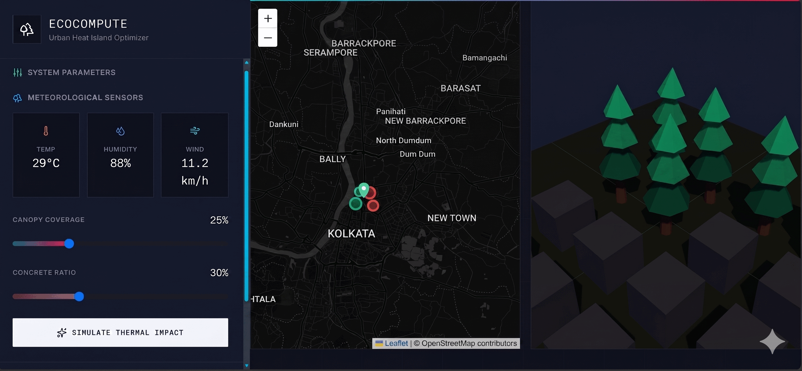
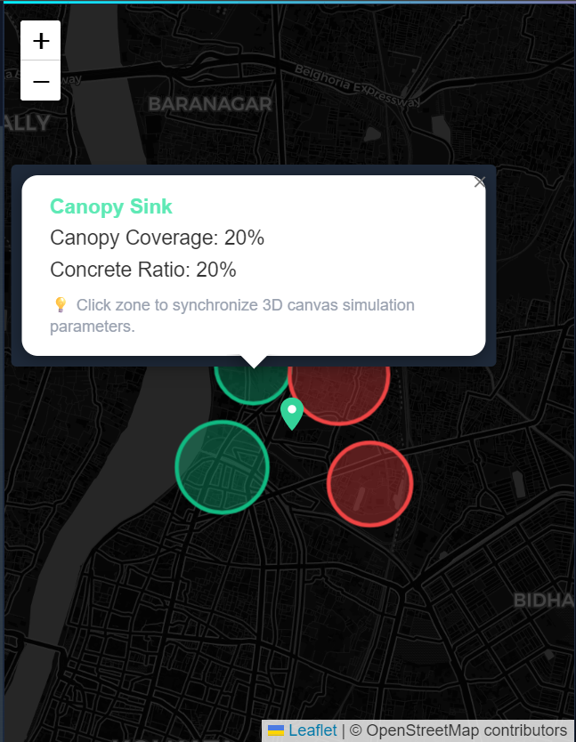
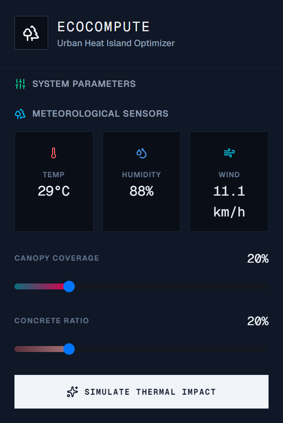
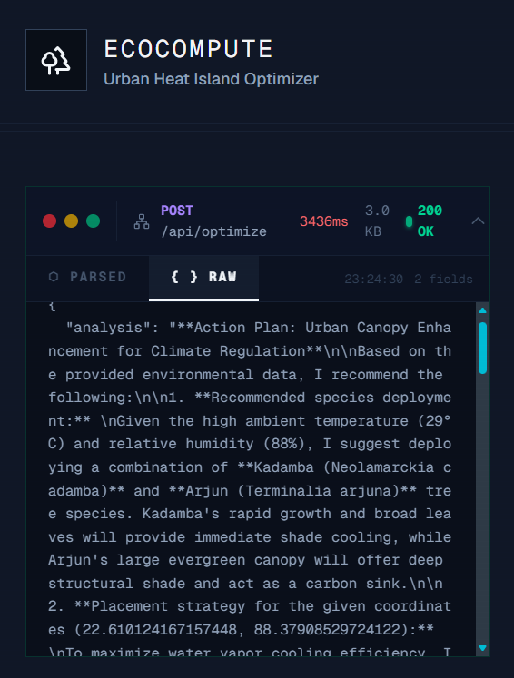
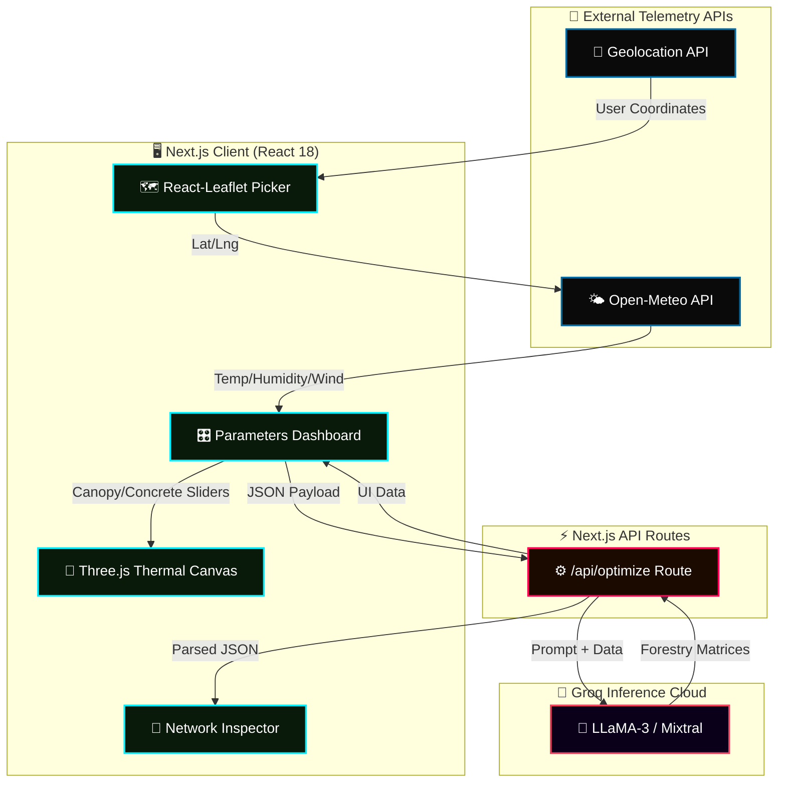
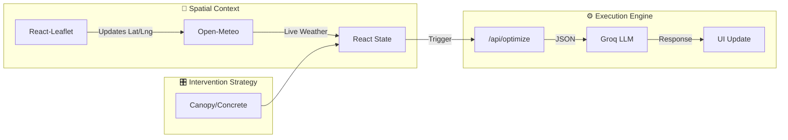
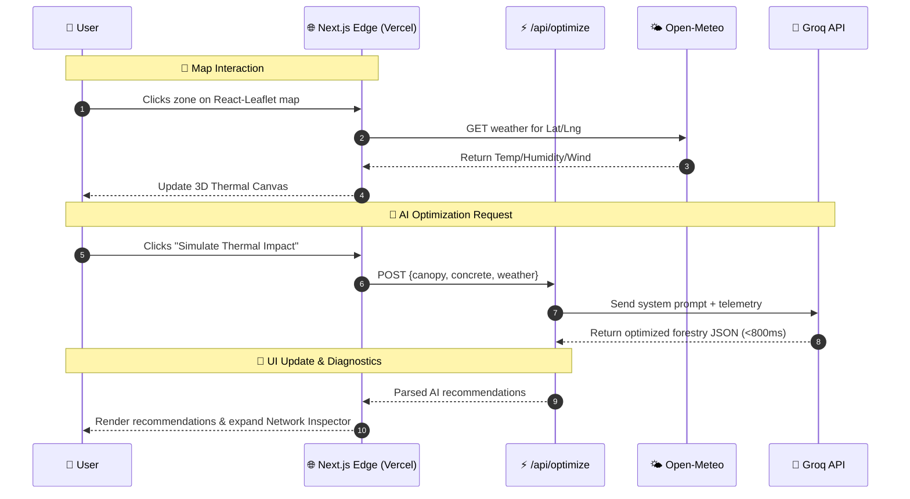

<div align="center">

<!-- ══════════════════════════════════════════════════════════════════ -->
<!--                        HERO BANNER                                 -->
<!-- ══════════════════════════════════════════════════════════════════ -->


<br/>

<!-- ── Hero Image / Demo ── -->
<a href="https://ecocompute.vercel.app/" target="_blank">
  
</a>

<br/><br/>


<br/><br/>

<!-- ── Badges Row 1 — Status ── -->
[](https://github.com/SalonyRanjan/EcoCompute-Urban-Heat-Island-Optimizer/actions)
[](https://github.com/SalonyRanjan/EcoCompute-Urban-Heat-Island-Optimizer/releases)
[](LICENSE)
[](https://github.com/SalonyRanjan/EcoCompute-Urban-Heat-Island-Optimizer/stargazers)

<br/>

<!-- ── Badges Row 2 — Tech ── -->


<br/>


<br/>


<br/><br/>

> *"A precision meteorological instrument and AI-powered simulation dashboard. EcoCompute models microclimate thermal impacts and generates data-driven urban forestry strategies."*

<br/>

<a href="https://ecocompute.vercel.app/"></a>
&nbsp;
<a href="#10--getting-started"></a>
&nbsp;
<a href="#5--architecture"></a>
&nbsp;
<a href="#9--roadmap"></a>

</div>

---

## 📋 Table of Contents

1. [🌍 What is EcoCompute?](#1--what-is-ecocompute)
2. [🖼️ Visual Showcase](#2-%EF%B8%8F-visual-showcase)
3. [📊 System at a Glance](#3--system-at-a-glance)
4. [✨ Key Features](#4--key-features)
5. [🏗️ Architecture](#5-%EF%B8%8F-architecture)
   - 5.1 [🔷 System Architecture Diagram](#51--system-architecture-diagram)
   - 5.2 [🔄 Telemetry Data Flow](#52--telemetry-data-flow)
   - 5.3 [⚡ Edge Execution Sequence](#53--edge-execution-sequence)
6. [🛠️ Tech Stack](#6-%EF%B8%8F-tech-stack)
   - 6.1 [🌐 Frontend & 3D Rendering](#61--frontend--3d-rendering)
   - 6.2 [🧠 AI & Data Engine](#62--ai--data-engine)
7. [🤔 Why I Built This](#7--why-i-built-this)
8. [📂 Project Structure](#8--project-structure)
9. [🗺️ Roadmap](#9-%EF%B8%8F-roadmap)
10. [📦 Getting Started](#10--getting-started)
    - 10.1 [🔧 Prerequisites](#101--prerequisites)
    - 10.2 [⬇️ Clone & Install](#102-%EF%B8%8F-clone--install)
    - 10.3 [🔑 Environment Variables](#103--environment-variables)
    - 10.4 [🖥️ Run Locally](#104-%EF%B8%8F-run-locally)
11. [🚀 Deployment](#11--deployment)
12. [⚡ Performance](#12--performance)
13. [🤝 Contributing](#13--contributing)
14. [❓ FAQ](#14--faq)
15. [📄 Changelog](#15--changelog)
16. [👤 Author](#16--author)
17. [⭐ Show Your Support](#17--show-your-support)

---

## 1. 🌍 What is EcoCompute?

**EcoCompute** is a high-performance analytics dashboard designed to simulate Urban Heat Island (UHI) effects. By combining real-time meteorological telemetry, spatial mapping, and a low-latency LLM backend, the system allows urban planners to calculate the cooling efficiency of targeted canopy coverage against concrete density.

Instead of generic dashboards, EcoCompute utilizes a strict **"Meteorological Blueprint"** aesthetic—acting as a precision military or satellite instrument with mathematically perfect UI geometry.

| 🔖 | Version | 📦 Highlight |
|:---:|:---:|:---|
| 🆕 | `v1.0` | Live Open-Meteo sync · Groq AI Engine · 3D Thermal Canvas · Terminal Network Inspector |

---

## 2. 🖼️ Visual Showcase

EcoCompute is a cinematic, data-dense experience—built to communicate complex environmental metrics instantly.

---

### 🗺️ Geospatial Telemetry — *Interactive MapPicker*

<div align="center">
  
  <p><i>Live coordinate selection with canopy/concrete zone synchronisation via React-Leaflet.</i></p>
</div>

> 🌐 **Hardware-Accurate Controls** — Click an environmental zone to instantly sync 3D canvas simulation parameters.

---

### 🌌 3D Thermal Canvas — *Microclimate Simulation*

<div align="center">
  
  <p><i>Real-time WebGL rendering of thermal heatmaps based on canopy-to-concrete ratios.</i></p>
</div>

> 🔥 **Fluid Thermal Gradients** — Visualizes the specific localized impact of the user's slider configurations.

---

### 🧠 AI Intervention Engine — *Groq-Powered Diagnostics*

<div align="center">
  
  <p><i>Instantaneously generated urban forestry matrices based on current telemetry.</i></p>
</div>

> ⚡ **Drought-Resistant Matching** — Analyzes local weather (temp, humidity, wind) to recommend specific flora (e.g., *Azadirachta indica*).

---

### 📡 Network Inspector — *Terminal Diagnostic View*

<div align="center">
  
  <p><i>Built-in terminal payload inspector tracking Groq latency and raw JSON byte sizes.</i></p>
</div>

---

## 3. 📊 System at a Glance

| 🔢 Metric | 🎯 Value | 📝 Notes |
|:---|:---:|:---|
| 🎯 **API Latency** | `< 800ms` | Groq LPU inference speed |
| 🔗 **Weather Source** | Open-Meteo API | Auto-fetches temp, humidity, wind |
| 🌍 **Mapping** | CartoDB Dark Matter | High-contrast brutalist map tiles |
| 🎨 **UI Engine** | Tailwind CSS | Strict utility classes, 0 drop-shadows |
| 🏗️ **Build Tool** | Next.js 14 | App Router + strict `React.JSX` typing |

---

## 4. ✨ Key Features

<table>
  <tr><td>🗺️</td><td><strong>Geospatial Telemetry</strong></td><td>Interactive mapping interface using <code>react-leaflet</code> for precise coordinate selection and thermal zone analysis.</td></tr>
  <tr><td>📡</td><td><strong>Live Weather Ingestion</strong></td><td>Automatic fetching of localized temperature, humidity, and wind speed via the Open-Meteo API based on map coordinates.</td></tr>
  <tr><td>🌌</td><td><strong>3D Thermal Visualization</strong></td><td>Immersive WebGL rendering of thermal impacts based on variable concrete-to-canopy ratios via Three.js.</td></tr>
  <tr><td>🧠</td><td><strong>Groq AI Engine</strong></td><td>Ultra-fast LLM backend analyzes spatial parameters to recommend highly specific, drought-resistant forestry matrices.</td></tr>
  <tr><td>⚙️</td><td><strong>Brutalist UI System</strong></td><td>"Meteorological Blueprint" aesthetic: Abyssal Blue (#090E17), 1px borders, and cyan/magenta thermal gradients.</td></tr>
  <tr><td>📊</td><td><strong>Terminal Network Inspector</strong></td><td>Built-in developer tool to monitor API latency, byte size, and expand/collapse raw JSON payload responses.</td></tr>
  <tr><td>📱</td><td><strong>Flawless Mobile Stacking</strong></td><td>Custom CSS Grid layout automatically stacks the configuration sidebar and 3D viewport perfectly on mobile devices.</td></tr>
  <tr><td>📺</td><td><strong>CRT Scanline Ambience</strong></td><td>Highly-performant CSS-only ambient scanline overlay (`mix-blend-overlay`) for hardware-terminal immersion.</td></tr>
</table>

---

## 5. 🏗️ Architecture

### 5.1 🔷 System Architecture Diagram



### 5.2 🔄 Telemetry Data Flow



### 5.3 ⚡ Edge Execution Sequence


---
## 6. 🛠️ Tech Stack

### 6.1 🌐 Frontend & 3D Rendering
<p>
  
  
  
  
  
</p>

### 6.2 🧠 AI & Data Engine
<p>
  
  
  
</p>

---

## 7. 🤔 Why I Built This

As an engineering student pursuing Computer Science and Business Systems, I wanted to bridge the gap between abstract algorithmic logic (my background in C++ DSA) and real-world urban infrastructure challenges. 

Most AI applications focus on chatbots or generic text generation. I built EcoCompute to prove that LLMs, when constrained by strict system prompts and fed real-time geospatial/meteorological telemetry, can act as deterministic simulation engines for urban planning. The UI is intentionally brutalist—rejecting consumer design trends to enforce the feel of a serious, high-performance scientific instrument.

---

## 8. 📂 Project Structure

```text
🌍 ecocompute/
│
├── 📂 app/                     # Next.js App Router
│   ├── 📂 api/optimize/        # Backend API route interacting with Groq
│   │   └── route.ts
│   ├── 🌐 icon.svg             # Custom bespoke SVG Favicon
│   ├── 🎨 globals.css          # Tailwind directives & CRT scanner CSS
│   ├── 📜 layout.tsx           # Global layout & metadata
│   └── 🏠 page.tsx             # Root dashboard & main UI logic
│
├── 🧩 components/              # React Client Components
│   ├── 🗺️ MapPicker.tsx        # React-Leaflet geospatial selector
│   ├── 🌌 HeatMap3D.tsx        # WebGL thermal canvas
│   ├── 📊 ThermalProfileChart.tsx # SVG graphical data readout
│   └── ⚙️ EcoComputeLogo.tsx   # Custom SVG branding component
│
├── 📄 .env.local               # Local environment variables (Groq Key)
├── 📄 tailwind.config.ts       # Tailwind theme extensions
├── 📄 package.json             # Dependencies
└── 📄 README.md                # Project documentation
```
---

## 9. 🗺️ Roadmap

| Status | 🚀 Feature | 🎯 Priority |
|:---:|:---|:---:|
| ✅ | Open-Meteo live synchronization | 🔴 Core |
| ✅ | Groq AI strategy generation | 🔴 Core |
| ✅ | React-Leaflet Map Picker | 🔴 Core |
| ✅ | Three.js thermal visualization | 🔴 Core |
| ✅ | Terminal Network Inspector | 🔴 Core |
| 🔄 | **Export to PDF** — Generate environmental compliance reports | 🟡 High |
| 🔄 | **Historical Data Mode** — Analyze UHI changes over the last decade | 🟡 High |
| 📅 | **Global Heatmap Presets** — Quick-jump to major metropolitan areas | 🟢 Planned |
| 💡 | **Satellite Layer Integration** — Mapbox satellite tiles in Leaflet | 🔵 Idea |

---

## 10. 📦 Getting Started

Get EcoCompute running locally in under **3 minutes**.

### 10.1 🔧 Prerequisites
Ensure you have Node.js 18+ installed on your local machine.

### 10.2 ⬇️ Clone & Install
```bash
git clone [https://github.com/SalonyRanjan/EcoCompute-Urban-Heat-Island-Optimizer.git](https://github.com/SalonyRanjan/EcoCompute-Urban-Heat-Island-Optimizer.git)
cd EcoCompute-Urban-Heat-Island-Optimizer
npm install
```

### 10.3 🔑 Environment Variables

Create a `.env.local` file in the root directory and securely add your Groq API key:

```env
GROQ_API_KEY=gsk_your_api_key_here
```

### 10.4 🖥️ Run Locally

```bash
npm run dev
```
Open http://localhost:3000 with your browser to access the telemetry dashboard.

## 11. 🚀 Deployment

This project is optimized for seamless deployment on Vercel.

1. Push your code to your GitHub repository.
2. Import the project into the [Vercel Dashboard](https://vercel.com/).
3. Ensure the framework preset is set to **Next.js**.
4. Add `GROQ_API_KEY` to the **Environment Variables** section.
5. Deploy. Vercel's strict TypeScript compiler is fully satisfied by the project's explicit `React.JSX` typings.

---

## 12. ⚡ Performance

| 📊 Metric | 🎯 Value | 📝 Implementation |
|:---|:---:|:---|
| 🎯 **API Latency** | `< 800ms` | Groq LPU inference (fastest LLM engine available) |
| ⚡ **Map Rendering** | `~100ms` | Dynamic imports (`next/dynamic`) bypass SSR hydration issues |
| 📦 **UI Rendering** | `0ms DOM Reflows` | CSS `linear-gradient` used for slider tracks instead of DOM elements |
| 📺 **Atmospherics** | Native CSS | Zero-JS `mix-blend-overlay` scanlines |

---

## 13. 🤝 Contributing

All contributions are **welcome**! 🌍

```bash
# 1. Fork the repository
# 2. Create your branch
git checkout -b feature/environmental-update

# 3. Commit with conventional format
git commit -m "feat: add mapbox satellite integration"

# 4. Push & open a PR
git push origin feature/environmental-update
```

## 14. ❓ FAQ

<details>
<summary><strong>🧠 Why use Groq instead of standard LLMs?</strong></summary>

Groq utilizes Language Processing Units (LPUs) which provide significantly faster inference speeds (often generating hundreds of tokens per second). For an application imitating a real-time hardware telemetry dashboard, the lower latency is essential for UX.
</details>

<details>
<summary><strong>🗺️ Why is react-leaflet dynamically imported?</strong></summary>

`react-leaflet` relies directly on the browser's `window` object to manipulate the DOM. Since Next.js uses Server-Side Rendering (SSR) by default, importing it normally causes a "window is not defined" crash. Using `next/dynamic` with `ssr: false` ensures the map only loads on the client.
</details>

<details>
<summary><strong>⚡ Why the strict React.JSX typings?</strong></summary>

Vercel uses a strict TypeScript compiler during the `npm run build` phase. Explicitly typing arrays of JSX elements as `React.JSX.Element[]` ensures complete type safety and prevents build failures in the CI/CD pipeline.
</details>

---

## 15. 📄 Changelog

| Version | Highlights |
|:---|:---|
| 🆕 `v1.0.0` | 🎉 Next.js App Router Setup · Open-Meteo Integration · React-Leaflet Map · Groq LLM Route · Mobile Stacking Fixes |

---

## 16. 👤 Author

<table style="border:none;">
  <tr>
    <td align="center" style="border:none;" width="160">
      
    </td>
    <td style="border:none; padding-left:22px;">
      <h3>✦ Salony Ranjan</h3>
      <p>🌍 Software Engineer &nbsp;·&nbsp; 🤖 AI/ML Integrator &nbsp;·&nbsp; 🚀 Full-Stack Builder</p>
      <p>B.Tech CSBS 2026 &nbsp;·&nbsp; Netaji Subhas Engineering College, Kolkata</p>
      <p><em>"Building precision instruments at the intersection of algorithms and impact."</em></p>
      <br/>
      <a href="https://www.linkedin.com/in/salonyranjan/"></a>
      &nbsp;
      <a href="https://github.com/SalonyRanjan"></a>
    </td>
  </tr>
</table>

---

## 17. ⭐ Show Your Support

<div align="center">

If EcoCompute helped you learn about geospatial integrations, Groq AI, or strict brutalist UI design—show it some love! 🌍

<a href="https://github.com/SalonyRanjan/EcoCompute-Urban-Heat-Island-Optimizer/stargazers"></a>
&nbsp;
<a href="https://github.com/SalonyRanjan/EcoCompute-Urban-Heat-Island-Optimizer/fork"></a>
&nbsp;
<a href="https://ecocompute.vercel.app/"></a>

<br/><br/>


<br/>

*Engineered with precision by* [**Salony Ranjan**](https://github.com/SalonyRanjan) &nbsp;·&nbsp; *© 2026 EcoCompute · MIT*


</div>
