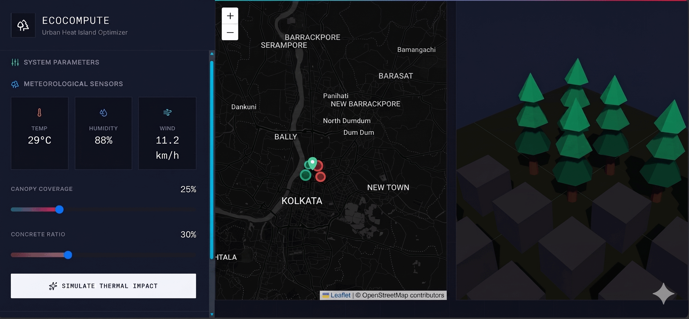
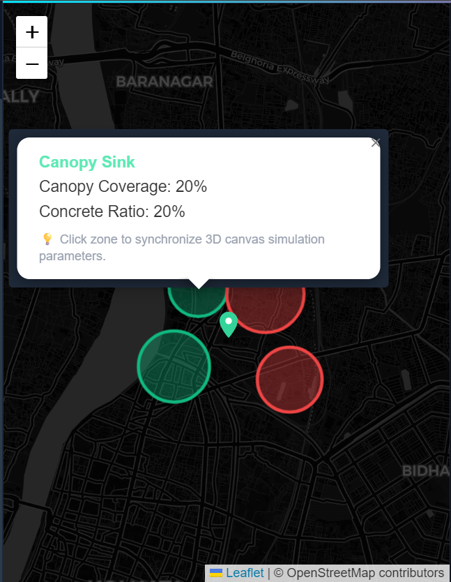
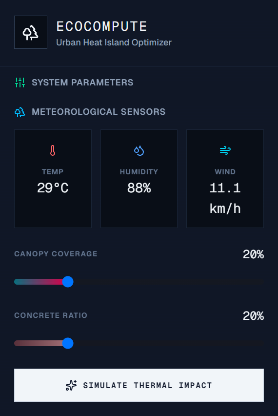
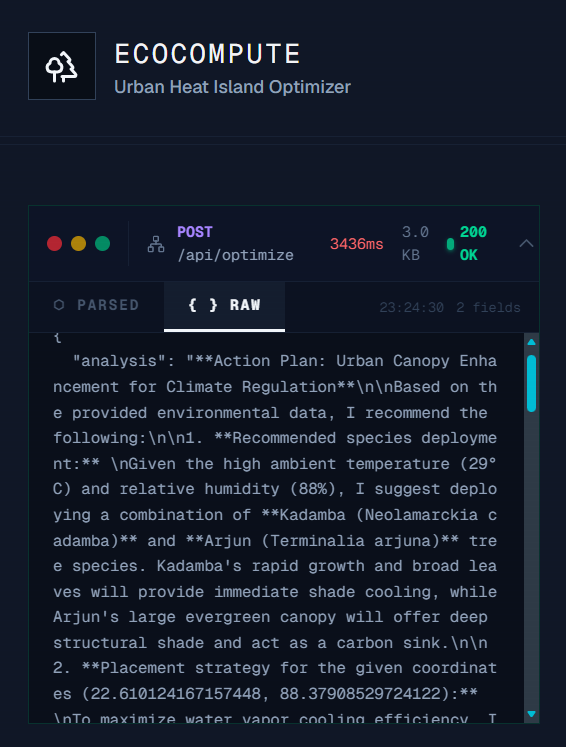
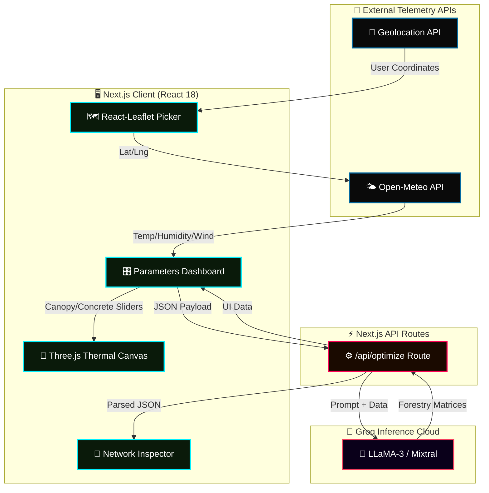
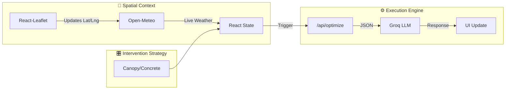
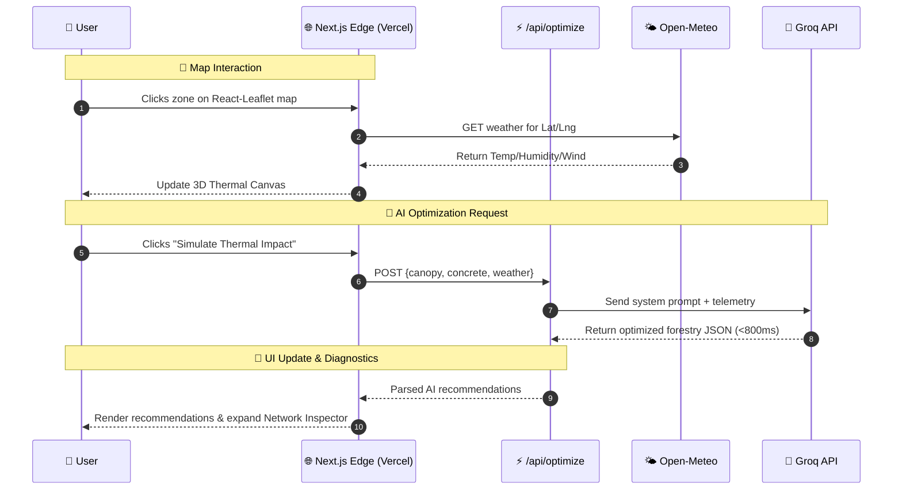

<div align="center">


<br/>

<a href="https://ecocompute.vercel.app/" target="_blank">
  
</a>

<br/><br/>


<br/>


<br/><br/>

> *"A precision meteorological instrument and AI-powered simulation dashboard. EcoCompute models microclimate thermal impacts and generates data-driven urban forestry strategies."*

<br/>

<a href="https://ecocompute.vercel.app/"></a>
&nbsp;
<a href="#-getting-started"></a>
&nbsp;
<a href="%EF%B8%8F-architecture"></a>
&nbsp;
<a href="https://github.com/salonyranjan/EcoCompute-Urban-Heat-Island-Optimizer/stargazers"></a>

</div>

<br/>

## 📋 Table of Contents

1. [What is EcoCompute?](#-what-is-ecocompute)
2. [Visual Showcase](#%EF%B8%8F-visual-showcase)
3. [System at a Glance](#-system-at-a-glance)
4. [Key Features](#-key-features)
5. [Architecture](#%EF%B8%8F-architecture)
6. [Tech Stack](#%EF%B8%8F-tech-stack)
7. [Why I Built This](#-why-i-built-this)
8. [Project Structure](#-project-structure)
9. [Roadmap](#%EF%B8%8F-roadmap)
10. [Getting Started](#-getting-started)
11. [Deployment](#-deployment)
12. [Performance](#-performance)
13. [FAQ](#-faq)
14. [Contributing](#-contributing)
15. [Author](#-author)

---

## 🌍 What is EcoCompute?

**EcoCompute** is a high-performance analytics dashboard that simulates Urban Heat Island (UHI) effects. By combining real-time meteorological telemetry, spatial mapping, and a low-latency LLM backend, it lets urban planners calculate the cooling efficiency of targeted canopy coverage against concrete density.

Instead of a generic dashboard, EcoCompute follows a strict **"Meteorological Blueprint"** aesthetic — built to feel like a precision satellite instrument, with mathematically deliberate UI geometry.

<div align="center">

| 🔖 Release | 📦 Highlight |
|:---:|:---|
| `v1.0` | Live Open-Meteo sync · Groq AI engine · 3D thermal canvas · terminal network inspector |

</div>

---

## 🖼️ Visual Showcase

<div align="center">

<table>
<tr>
<td width="50%" align="center">

<br/><b>Geospatial Telemetry</b><br/>
<sub>Live coordinate selection with canopy/concrete zone sync via React-Leaflet.</sub>
</td>
<td width="50%" align="center">

<br/><b>3D Thermal Canvas</b><br/>
<sub>Real-time WebGL heatmaps based on canopy-to-concrete ratios.</sub>
</td>
</tr>
<tr>
<td width="50%" align="center">

<br/><b>AI Intervention Engine</b><br/>
<sub>Groq-generated forestry matrices matched to current telemetry.</sub>
</td>
<td width="50%" align="center">

<br/><b>Network Inspector</b><br/>
<sub>Built-in terminal view tracking Groq latency and raw JSON payloads.</sub>
</td>
</tr>
</table>

</div>

> 🔥 **Drought-resistant matching** — analyzes local weather (temp, humidity, wind) to recommend specific flora, e.g. *Azadirachta indica*.

---

## 📊 System at a Glance

| Metric | Value | Notes |
|:---|:---:|:---|
| API Latency | `< 800ms` | Groq LPU inference speed |
| Weather Source | Open-Meteo API | Auto-fetches temp, humidity, wind |
| Mapping | CartoDB Dark Matter | High-contrast brutalist map tiles |
| UI Engine | Tailwind CSS | Strict utility classes, zero drop-shadows |
| Build Tool | Next.js 14 | App Router + strict `React.JSX` typing |

---

## ✨ Key Features

| | Feature | Description |
|:---:|:---|:---|
| 🗺️ | **Geospatial Telemetry** | Interactive mapping via `react-leaflet` for precise coordinate selection and thermal zone analysis |
| 📡 | **Live Weather Ingestion** | Automatic temperature, humidity, and wind-speed fetch via Open-Meteo, keyed to map coordinates |
| 🌌 | **3D Thermal Visualization** | Immersive WebGL rendering of thermal impact based on variable concrete-to-canopy ratios |
| 🧠 | **Groq AI Engine** | Ultra-fast LLM backend recommends drought-resistant forestry matrices from spatial parameters |
| ⚙️ | **Brutalist UI System** | "Meteorological Blueprint" aesthetic — Abyssal Blue (`#090E17`), 1px borders, cyan/magenta thermal gradients |
| 📊 | **Terminal Network Inspector** | Built-in dev tool for API latency, byte size, and expandable raw JSON payloads |
| 📱 | **Flawless Mobile Stacking** | Custom CSS Grid stacks the config sidebar and 3D viewport cleanly on mobile |
| 📺 | **CRT Scanline Ambience** | Performant CSS-only scanline overlay (`mix-blend-overlay`) for hardware-terminal feel |

---

## 🏗️ Architecture


```mermaid
graph TD
    subgraph External_Sensors ["📡 External Telemetry APIs"]
        GEO[📍 Geolocation API]
        WEATHER[🌤️ Open-Meteo API]
    end

    subgraph Client ["🖥️ Next.js Client (React 18)"]
        UI[🎛️ Parameters Dashboard]
        MAP[🗺️ React-Leaflet Picker]
        T3D[🌌 Three.js Thermal Canvas]
        INSP[📡 Network Inspector]
    end

    subgraph Edge_Backend ["⚡ Next.js API Routes"]
        OPT[⚙️ /api/optimize Route]
    end

    subgraph Cloud_AI ["🧠 Groq Inference Cloud"]
        LLM[🤖 LLaMA-3 / Mixtral]
    end

    GEO -->|User Coordinates| MAP
    MAP -->|Lat/Lng| WEATHER
    WEATHER -->|Temp/Humidity/Wind| UI
    UI -->|Canopy/Concrete Sliders| T3D
    UI -->|JSON Payload| OPT
    OPT -->|Prompt + Data| LLM
    LLM -->|Forestry Matrices| OPT
    OPT -->|Parsed JSON| INSP
    OPT -->|UI Data| UI

    classDef external fill:#0a0a0a,stroke:#0369a1,stroke-width:2px,color:#fff;
    classDef client fill:#0a1a0a,stroke:#00F0FF,stroke-width:2px,color:#fff;
    classDef backend fill:#1a0a00,stroke:#FF0055,stroke-width:2px,color:#fff;
    classDef ai fill:#0a001a,stroke:#f43f5e,stroke-width:2px,color:#fff;

    class GEO,WEATHER external;
    class UI,MAP,T3D,INSP client;
    class OPT backend;
    class LLM ai;
```

<details>
<summary><b>🔄 Telemetry data flow</b></summary>


```mermaid
flowchart LR
    subgraph Context ["📍 Spatial Context"]
        MAP[React-Leaflet] -->|Updates Lat/Lng| OM[Open-Meteo]
        OM -->|Live Weather| STATE[React State]
    end

    subgraph Intervention ["🎛️ Intervention Strategy"]
        SLIDERS[Canopy/Concrete] --> STATE
    end

    subgraph Simulation ["⚙️ Execution Engine"]
        STATE -->|Trigger| API["/api/optimize"]
        API -->|JSON| GROQ[Groq LLM]
        GROQ -->|Response| DASH[UI Update]
    end
```

</details>

<details>
<summary><b>⚡ Edge execution sequence</b></summary>


```mermaid
sequenceDiagram
    autonumber
    participant U  as 👤 User
    participant FE as 🌐 Next.js Edge (Vercel)
    participant API as ⚡ /api/optimize
    participant OM as 🌤️ Open-Meteo
    participant AI as 🧠 Groq API

    Note over U,FE: 📍 Map Interaction
    U->>FE: Clicks zone on React-Leaflet map
    FE->>OM: GET weather for Lat/Lng
    OM-->>FE: Return Temp/Humidity/Wind
    FE-->>U: Update 3D Thermal Canvas

    Note over U,AI: 🧠 AI Optimization Request
    U->>FE: Clicks "Simulate Thermal Impact"
    FE->>API: POST {canopy, concrete, weather}
    API->>AI: Send system prompt + telemetry
    AI-->>API: Return optimized forestry JSON (<800ms)

    Note over API,U: 📡 UI Update & Diagnostics
    API-->>FE: Parsed AI recommendations
    FE-->>U: Render recommendations & expand Network Inspector
```

</details>

---

## 🛠️ Tech Stack

<table>
<tr><td valign="top" width="50%">

**🌐 Frontend & 3D**
- Next.js 14 (App Router)
- React 18
- Tailwind CSS
- Three.js (WebGL)
- React-Leaflet

</td><td valign="top" width="50%">

**🧠 AI & Data**
- TypeScript (strict)
- Groq API — LPU inference
- Open-Meteo REST API

</td></tr>
</table>

---

## 🤔 Why I Built This

As an engineering student pursuing Computer Science and Business Systems, I wanted to bridge abstract algorithmic logic — my background in C++ DSA — with real-world urban infrastructure challenges.

Most AI applications default to chatbots or generic text generation. EcoCompute is meant to show that LLMs, constrained by strict system prompts and fed real-time geospatial and meteorological telemetry, can act as deterministic simulation engines for urban planning. The brutalist UI is intentional — it rejects consumer design trends to feel like a serious, high-performance scientific instrument rather than another SaaS dashboard.

---

## 📂 Project Structure

```
ecocompute/
├── app/                          # Next.js App Router
│   ├── api/optimize/route.ts      # Backend API route talking to Groq
│   ├── icon.svg                   # Custom SVG favicon
│   ├── globals.css                # Tailwind directives & CRT scanner CSS
│   ├── layout.tsx                 # Global layout & metadata
│   └── page.tsx                   # Root dashboard & main UI logic
├── components/
│   ├── MapPicker.tsx               # React-Leaflet geospatial selector
│   ├── HeatMap3D.tsx               # WebGL thermal canvas
│   ├── ThermalProfileChart.tsx     # SVG graphical data readout
│   └── EcoComputeLogo.tsx          # Custom SVG branding component
├── .env.local                    # Local environment variables (Groq key)
├── tailwind.config.ts
├── package.json
└── README.md
```

---

## 🗺️ Roadmap

- [x] Open-Meteo live synchronization
- [x] Groq AI strategy generation
- [x] React-Leaflet map picker
- [x] Three.js thermal visualization
- [x] Terminal network inspector
- [ ] **Export to PDF** — generate environmental compliance reports
- [ ] **Historical data mode** — analyze UHI changes over the last decade
- [ ] **Global heatmap presets** — quick-jump to major metropolitan areas
- [ ] 💡 Satellite layer integration — Mapbox satellite tiles in Leaflet

> 💬 [Open a feature request →](https://github.com/salonyranjan/EcoCompute-Urban-Heat-Island-Optimizer/issues/new)

---

## 📦 Getting Started

**Prerequisites:** Node.js ≥ 18

```bash
# Clone
git clone https://github.com/salonyranjan/EcoCompute-Urban-Heat-Island-Optimizer.git
cd EcoCompute-Urban-Heat-Island-Optimizer

# Install
npm install
```

**Configure secrets** — create `.env.local` in the root:

```env
GROQ_API_KEY=gsk_your_api_key_here
```

**Run it:**

```bash
npm run dev
```

Open **http://localhost:3000** to access the telemetry dashboard.

---

## 🚀 Deployment

Optimized for seamless deployment on **Vercel**:

1. Push your code to GitHub
2. Import the project in the [Vercel Dashboard](https://vercel.com/)
3. Confirm the framework preset is **Next.js**
4. Add `GROQ_API_KEY` under Environment Variables
5. Deploy — the project's explicit `React.JSX` typings satisfy Vercel's strict TypeScript compiler out of the box

---

## ⚡ Performance

| Metric | Value | Implementation |
|:---|:---:|:---|
| API Latency | `< 800ms` | Groq LPU inference — among the fastest LLM engines available |
| Map Rendering | `~100ms` | Dynamic imports (`next/dynamic`) bypass SSR hydration issues |
| UI Rendering | `0ms DOM reflows` | CSS `linear-gradient` slider tracks instead of DOM elements |
| Atmospherics | Native CSS | Zero-JS `mix-blend-overlay` scanlines |

---

## ❓ FAQ

<details>
<summary><b>Why Groq instead of a standard LLM API?</b></summary><br/>

Groq's Language Processing Units (LPUs) deliver significantly faster inference — often hundreds of tokens per second. For a dashboard designed to feel like real-time hardware telemetry, that latency reduction matters for the UX.
</details>

<details>
<summary><b>Why is react-leaflet dynamically imported?</b></summary><br/>

`react-leaflet` relies directly on the browser's `window` object. Since Next.js server-renders by default, a normal import throws a "window is not defined" error. `next/dynamic` with `ssr: false` ensures the map only loads client-side.
</details>

<details>
<summary><b>Why the strict React.JSX typings?</b></summary><br/>

Vercel runs a strict TypeScript compiler during `npm run build`. Explicitly typing JSX element arrays as `React.JSX.Element[]` keeps type safety complete and prevents CI/CD build failures.
</details>

---

## 🤝 Contributing

```bash
git checkout -b feature/environmental-update
git commit -m "feat: add mapbox satellite integration"
git push origin feature/environmental-update
```

**Priority areas:** PDF compliance-report export · historical UHI data mode · global heatmap presets · satellite tile integration.

---

## 👤 Author

<table style="border:none;">
  <tr>
    <td align="center" style="border:none;" width="150">
      
    </td>
    <td style="border:none; padding-left:22px;">
      <h3>✦ Salony Ranjan</h3>
      <p><em>"Building precision instruments at the intersection of algorithms and impact."</em></p>
      <br/>
      <a href="https://www.linkedin.com/in/salonyranjan/"></a>
      &nbsp;
      <a href="https://github.com/salonyranjan"></a>
    </td>
  </tr>
</table>

---

<div align="center">

### ⭐ If EcoCompute taught you something about geospatial AI or brutalist UI — star it

<a href="https://github.com/salonyranjan/EcoCompute-Urban-Heat-Island-Optimizer/stargazers"></a>
&nbsp;
<a href="https://github.com/salonyranjan/EcoCompute-Urban-Heat-Island-Optimizer/fork"></a>
&nbsp;
<a href="https://ecocompute.vercel.app/"></a>

<br/><br/>


*Engineered with precision by* [**Salony Ranjan**](https://github.com/salonyranjan) &nbsp;·&nbsp; *© 2026 EcoCompute · MIT License*


</div>
